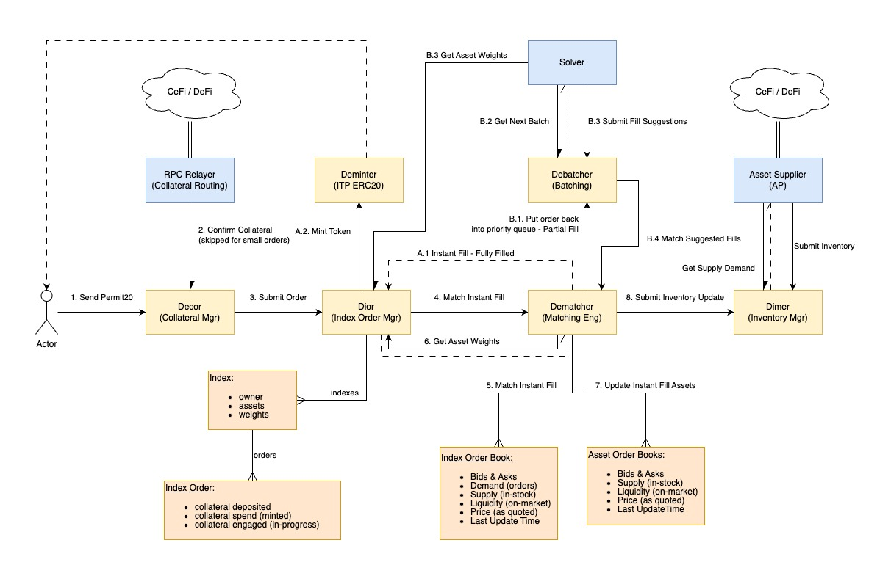

# Decentralised Index Maker

## About

This is ***Decentralised Index Maker (DeIndex)*** project.


## Architecture

### **On-Chain Components:**

There is plan to produce several smart-contracts:

- `debatcher` - Decentralised Batch Manager
- `decor`     - Decentralised Collateral Router
- `dematcher` - Decentralised Matching Engine
- `deminter`  - Decentralised ITP Token Minting
- `dimer`     - Decentralised Inventory Manager
- `dior`      - Decentralised Index Order Manager

### **Off-Chain Components**

And we will have an off-chain robot:

- `ap`      - Authorized Provider for supplying assets from CEX / DEX
- `solver`  - Solver off-loading `dematcher` by computing fill "suggestions"
- `relayer` - RPC Relayer for collateral routing

### **Interaction**



The flow illustrates an intricate, multi-contract interaction designed to
process the creation (minting) of an index token (ITP ERC20) in exchange for
underlying collateral, using both instant on-chain matching and off-chain batch
optimization (Solver).

|Smart Contract/Entity|Role in DeFi Architecture|Key Function|
|---|---|---|
|Dior (Index Order Mgr)|Core Protocol Contract|Manages the order lifecycle| owns the Index Book data| and orchestrates calls to other contracts (Matching| Minting).|
|Decor (Collateral Mgr)|Collateral/Vault Contract|Handles the secure receipt and lock-up of user collateral (likely using Permit20 approval).|
|Dematcher (Matching Eng)|Matching Logic Contract|Executes the immediate, on-chain matching logic against available liquidity in the books.|
|Dimer (Inventory Mgr)|Liquidity/Asset Contract|Manages the balances and updates the supply/demand for the individual component assets of the index.|
|Deminter (ITP ERC20)|Token Standard Contract|The contract for the Index Tracking Token (ITP) itself, which handles the Minting of new tokens to the user.|
|Debatcher (Batching)|Queue Management Contract|Holds non-instantly fillable orders and interacts with the external Solver for optimization.|
|Solver|External HFT Agent|An off-chain, meticulous optimizer that determines the best execution for batched orders.|

|Data Structure|Content|
|---|---|
|Index Order Book|Bids & Asks, Demand (orders), Supply (in-stock), Liquidity (on-market), Price (as quoted), Last Update Time.|
|Asset Order Books|Bids & Asks, Supply (in-stock), Liquidity (on-market), Price (as quoted), Last Update Time (per asset).|
|Index|owner, assets, weights (The index definition).|
|Index Order|collateral deposited, collateral spend (minted), collateral engaged (in-progress).|

### The Flow as Smart Contract Interactions

#### Flow A: Instant Fill (On-Chain)

This is the standard, fast path, executed atomically within a single transaction if possible.

1. Actor initiates: The Actor (user) sends a transaction authorizing Decor to spend their collateral using the 1. Send Permit20 signature/call.

1. Decor Logic: 2. Confirm Collateral checks the collateral in the contract.

1. Order Submission: Decor calls Dior (3. Submit Order), passing the user's details and collateral status.

1. Matching Attempt: Dior calls Dematcher (4. Match Instant Fill).

1. Book Update: Dematcher successfully executes the fill, updating state variables in the Asset Order Books and notifying Dimer (8. Submit Inventory Update) to update its internal supply records.

1. Finalization: Dematcher calls back to Dior (A.1 Instant Fill - Fully Filled). Dior then calls Deminter (A.2. Mint Token) to finalize the index token transfer to the user.

#### Flow B: Batch / Solve (Off-Chain Optimization)

This path handles complex or large orders that require external, potentially more "meticulous" computation for the best price execution (a common pattern in DeFi, similar to AMMs or decentralized exchanges).

1. Dematcher → Debatcher: If the instant match is incomplete, the remaining order portion is placed into the Debatcher smart contract queue.

1. External Solver Operation: The Solver (an external, off-chain service, maybe run by a sequencer or specialized agent) pulls the batch (B.2 Get Next Batch), determines the optimal way to fill those orders, and sends the calculated fill details back to the Debatcher contract (B.3 Submit Fill Suggestions).

1. On-Chain Execution: The Debatcher then triggers the Dematcher (B.4 Match Suggested Fills) to execute the fills based on the Solver's suggestions.

#### Summary

This architecture showcases a sophisticated DeFi design utilizing multiple specialized contracts for core functions (Collateral, Order Management, Matching, and Minting), while incorporating an off-chain component (Solver) to maintain efficiency and competitive pricing for complex or batched orders.


## Development

The development process is simple, but requires meticulous approach as the
integration of the **off-chain** code with **on-chain** smart-contracts needed
to setup workspace is this specific manner.

### **Scripts:** Build, Test & Deploy Smart-Contracts

There are scripts provided in `./scripts` directory to manage Stylus contracts.
These scripts are necessary as we were unable to use Stylus with Cargo Workspace
correctly. Using these scripts we can build both Stylus contracts and off-chain
Access Point (AP) robot, which can share librares such as `deli` (Decentralised
Utility Lib). We set-up `deli` in such a way that it builds with `no_std` for
linking with Stylus smart-contracts, and with `std` otherwise. Sharing `deli`
with off-chain code is critical to ensure that binary blob serialization is
consistent between smart-contracts and off-chain code. We developed absolutely
minimal serialisation, which supports only decimal and vector data types. We
provded our own 128-bit decimal data type, as we have found that rust_decimal
takes up more space in wasm. We tested bincode and serde both json and rmp, and
they were bloating wasm size way beyond 24kB limit. To keep wasm size tiny we
implemented minimalistic `delib` utility library. We use binary blobs containing
vectors of decimals as inspired by such libraries as OpenGL or OpenAL. With this
approach we keep structure of blobs simple, and we minimise the amount of code
required to handle blobs. Any array data would be passed as such blobs storing
vectors of decimals as a default mechanism.

### Setup Steps

**NOTE** For best results it is best to follow these steps in this concrete sequence, as otherwise things may not work!

**IMPORTANT** DO NOT USE ~~`cargo update`~~ as this will definitely break tests.

#### 1. Run Tests

Build & run tests by using standard:
```
cargo test
```

Alternatively build tests for specific contract with debug logging:
```
./scripts/test-debug.sh CONTRACT_NAME
```

Example:
```
./scripts/test-debug.sh disolver
```

#### 2. Launch Arbitrum Nitro Node

Firt clone Nitro Development Node repository:
```bash
git clone https://github.com/OffchainLabs/nitro-devnode.git
```

And then launch:
```bash
./run-dev-node.sh
```

#### 3. Build Contracts

Build each contract by using scripts provided:
```
./scripts/check.sh CONTRACT_NAME
```

Example:
```
./scripts/check.sh disolver
```

#### 5. Deploy Contracts

Deploy contracts each contract by using scripts provided:
```
./scripts/deploy.sh CONTRACT_NAME
```

Example:
```
./scripts/deploy.sh disolver
```

#### 6. Export Contracts ABI

Export contracts ABI each contract by using scripts provided:
```
./scripts/export-abi.sh CONTRACT_NAME
```

Example:
```
./scripts/export-abi.sh disolver
```
