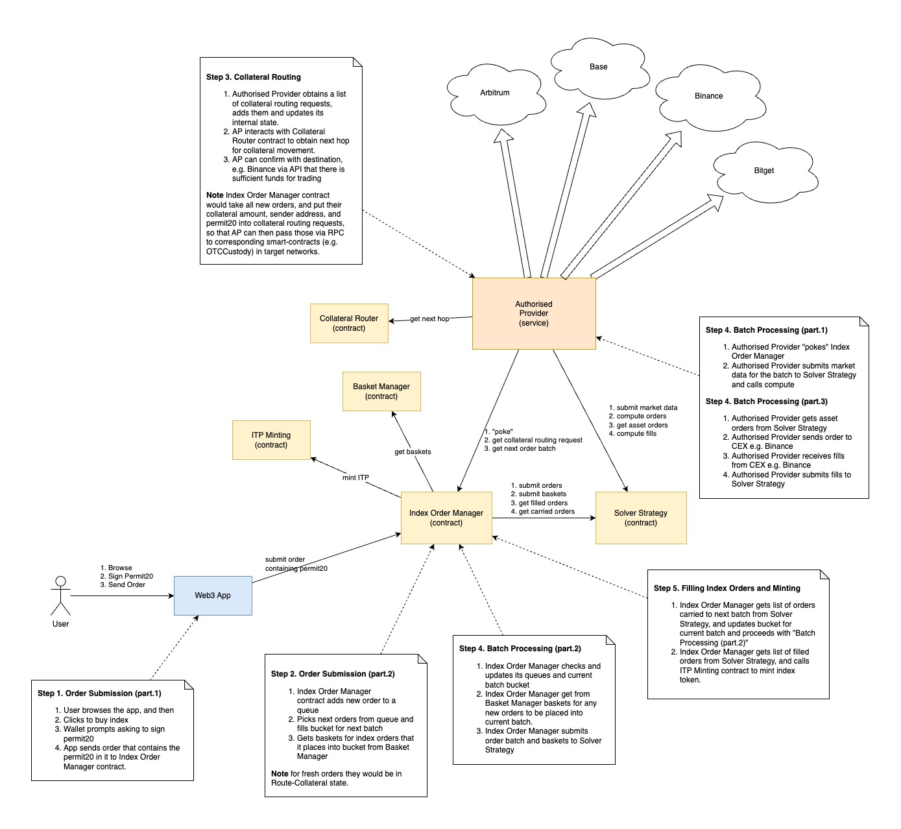

# Decentralised Index Maker

## About

This is ***Decentralised Index Maker (DeIndex)*** project.


## Architecture

#### **On-Chain Components:**

There is plan to produce several smart-contracts:

- `debasket` - Decentralised Basket Manager
- `decor`    - Decentralised Collateral Router
- `deminter` - Decentralised ITP Token Minting
- `dior`     - Decentralised Index Order Manager
- `disolver` - Decentralised Index Solver Strategy

#### **Off-Chain Components**

And we will have an off-chain robot:

- `ap` - Authorized Provider

#### **Interaction**



Here is rough overview of the interaction:

***NOTE:** By no means this is a final design, and it will be updated as we progress with development.*

- User will interact with Web3 app, which will send an order message containing *ERC20Permit (EIP-2612)* signed by user. Message will be sent via interaction with `Dior` contract, which will:
    - record the order, and
    - organise orders into batches.
- `AP` an off-chain service, which sends orders to CEX, will periodically *"poke"* `Dior` contract to obtain next batch. The *"poke"* will include market-data.

**Note:** It is critical that `AP` in the *"poke"* sends live market-data to
`Dior` contract, so that the `Disolver` contract, which is invoked by `Dior`
contract will compute _fillable_ asset orders. Note that `AP` sends those orders
to CEX, and they must have prices and quantities that match current state of
order books, and we must be mindfull that this is time-critical operation.

*-- Here is the boundary where `AP` interacts with `Dior` sending data, which
could be validated and signed. Note that sending orders is time-critical and
opting out from verification of asset orders may be necessary. `AP` is a trusted
service, and it should validate the orders on its own without involving on-chain
activity. `AP` is polling `Dior`, so it can trust computed orders (tbd) --*

- `Dior` contract will organise next batch of orders to be processed, and it will:
    - interact with `Debasket` to obtain underlying assets for all orders in a batch, and
    - send batch data to `Disolver` so it can compute all trading parameters, and then
    - emit an event containing *computation context ID*.
- `Disolver` contract will: 
    - compute strategy, and 
    - store resulting data in its *internal computation context*.

*-- Here is another the boundary where `AP` will be receiving computed orders,
we may want to validate and sign, but again we must consider that this is
time-critical path, and `AP` is a trusted service (tbd) --*

- `AP` will: 
    - receive an event containing *computation context ID`, and
    - will retrieve from `Disolver` contract from that computation context a
    vector of computed underlying asset quantities from 
    - send orders to CEX accordingly and receive fills
    - interact with `Disolver` contract sending the fills (prices, quantities, fees)

**Note:** We will need to also interact with `Decor` contract to do
collateral routing (tbd)

*-- Here is the boundary where `AP` will be interacting with `Disolver`, we may
we may want to validate and sign, but again we must consider that this is
time-critical path, and `AP` is a trusted service (tbd) --*

- `Disolver` contract will:
    - compute filled index quantities, and 
    - quantities unfilled, carried-over to next iteration, and
    - quantities of underlying assets that were received, but not yet allocated
    to any index order.
    - store all the above results into *computation context* for later retrieval.

- In the next *"poke"* from `AP` to `Dior` contract, the `Dior` contract will:
    - check results in the *computation context*, and
    - update state of index orders in the last batch, and
    - remove fully-filled index orders from last batch, and 
        - replace them with new index orders
        - send them to minting to `Deminter` contract (tbd)


## Development

The development process is simple, but requires meticulous approach as the
integration of the **off-chain** code with **on-chain** smart-contracts needed
to setup workspace is this specific manner.

### **Scripts:** Build, Test & Deploy Smart-Contracts

There are scripts provided in `./scripts` directory to manage Stylus contracts.
These scripts are necessary as we were unable to use Stylus with Cargo Workspace
correctly. Using these scripts we can build both Stylus contracts and off-chain
Access Point (AP) robot, which can share librares such as `deli` (Decentralised
Utility Lib). We set-up `deli` in such a way that it builds with `no_std` for
linking with Stylus smart-contracts, and with `std` otherwise. Sharing `deli`
with off-chain code is critical to ensure that binary blob serialization is
consistent between smart-contracts and off-chain code. We developed absolutely
minimal serialisation, which supports only decimal and vector data types. We
provded our own 128-bit decimal data type, as we have found that rust_decimal
takes up more space in wasm. We tested bincode and serde both json and rmp, and
they were bloating wasm size way beyond 24kB limit. To keep wasm size tiny we
implemented minimalistic `delib` utility library. We use binary blobs containing
vectors of decimals as inspired by such libraries as OpenGL or OpenAL. With this
approach we keep structure of blobs simple, and we minimise the amount of code
required to handle blobs. Any array data would be passed as such blobs storing
vectors of decimals as a default mechanism.

### Setup Steps

**NOTE** For best results it is best to follow these steps in this concrete sequence, as otherwise things may not work!

**IMPORTANT** DO NOT USE ~~`cargo update`~~ as this will definitely break tests.

#### 1. Run Tests

Build & run tests by using standard:
```
cargo test
```

Alternatively build tests for specific contract with debug logging:
```
./scripts/test-debug.sh CONTRACT_NAME
```

Example:
```
./scripts/test-debug.sh disolver
```

#### 2. Launch Arbitrum Nitro Node

Firt clone Nitro Development Node repository:
```bash
git clone https://github.com/OffchainLabs/nitro-devnode.git
```

And then launch:
```bash
./run-dev-node.sh
```

#### 3. Build Contracts

Build each contract by using scripts provided:
```
./scripts/check.sh CONTRACT_NAME
```

Example:
```
./scripts/check.sh disolver
```

#### 5. Deploy Contracts

Deploy contracts each contract by using scripts provided:
```
./scripts/deploy.sh CONTRACT_NAME
```

Example:
```
./scripts/deploy.sh disolver
```

#### 6. Export Contracts ABI

Export contracts ABI each contract by using scripts provided:
```
./scripts/export-abi.sh CONTRACT_NAME
```

Example:
```
./scripts/export-abi.sh disolver
```
